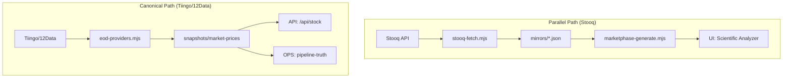

# Audit Phase 5: SSOT Violations

## Major Violation: Parallel Data Paths

### 1. MarketPhase (UI) vs Pipeline Truth (OPS)
*   **Description**: The UI's "Scientific Analyzer" and "Elliott Waves" features rely on `marketphase` artifacts. These artifacts are generated from **Stooq** data, whereas the OPS `pipeline-truth` and `/api/stock` endpoints rely on **Tiingo/TwelveData**.
*   **Severity**: **CRITICAL** (Data Divergence Risk)
*   **Evidence**:
    *   `scripts/utils/eod-market-symbols.mjs` imports `fetchStooqDaily` and fetches data directly.
    *   `functions/api/stock.js` uses `fetchBarsWithProviderChain` (Tiingo/TwelveData).
    *   `scripts/marketphase-generate.mjs` consumes `mirrors/` (Stooq-derived).
*   **Impact**:
    *   Price descrepancies between "Analysis" views (Stooq) and "Stock Details" views (Tiingo).
    *   OPS Green status (`pipeline-truth`) does not guarantee UI correctness (`marketphase` generation could fail independently).

### 2. Snapshot vs Mirror Duplication
*   **Description**: The `mirrors/` directory duplicates the purpose of `data/snapshots/`.
*   **Evidence**:
    *   `mirrors/quotes.json` vs `snapshots/market-prices.json`.
    *   `mirrors/tech-signals.json` vs `snapshots/market-stats.json`.
*   **Recommendation**: Deprecate `mirrors/` generation logic and derived `mirrors` from the canonical `snapshots`.

## Diagram

